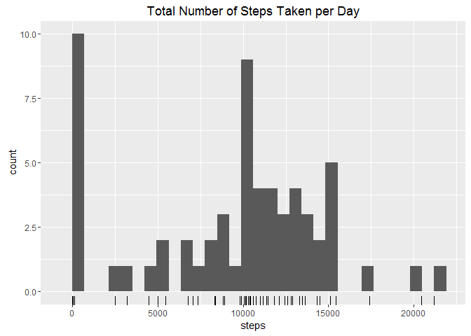
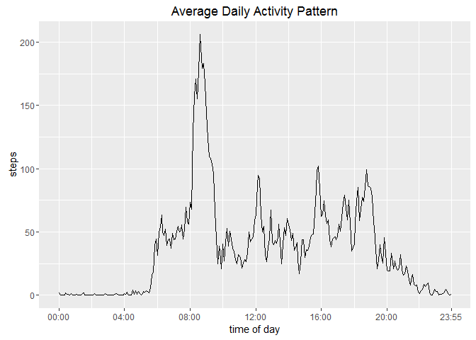
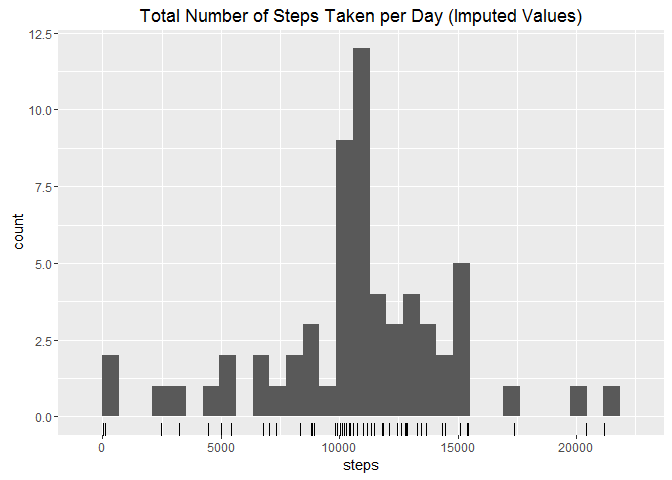
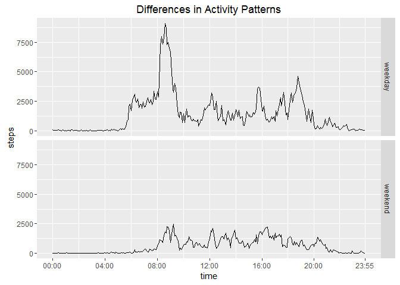

# Reproducible Research: Peer Assessment 1

We will use the `dplyr` package to simplify data operations, `lubridate` for date operations, and `ggplot2` for graphics. If the `dplyr`, `lubridate` or `ggplot2` package is not installed, please install it using ```install.packages('dplyr', 'lubridate', 'ggplot2')```


```r
  library(dplyr)
  library(lubridate)
  library(ggplot2)
```

## Loading and preprocessing the data
Load the data from ./activity.zip:activity.csv into activity.data. Convert the date from a character string to a date object and add a column translating interval to time of day. Then examine the basic structure to ensure it loaded correctly.

```r
  stopifnot(file.exists('./activity.zip'))
  
  activity.data <- unz('./activity.zip', 'activity.csv') %>%
    read.csv(colClasses = c('integer', 'character', 'integer')) %>%
    transmute(
      date = ymd(date),
      time = sprintf('%02i:%02i', interval %/% 100, interval %% 100 %% 60),
      steps)
  
  str(activity.data)
```

```
## 'data.frame':	17568 obs. of  3 variables:
##  $ date : POSIXct, format: "2012-10-01" "2012-10-01" ...
##  $ time : chr  "00:00" "00:05" "00:10" "00:15" ...
##  $ steps: int  NA NA NA NA NA NA NA NA NA NA ...
```

## What is mean total number of steps taken per day?
Group the data by date, sum the number of steps and find the average.

```r
  by.day <- activity.data %>%
    group_by(date) %>%
    summarize(steps = sum(steps, na.rm=TRUE))
  mean.daily.steps <- mean(by.day$steps)
  median.daily.steps <- median(by.day$steps)
  
  qplot(by.day$steps, xlab='steps', geom=c('histogram', 'rug'),
        main='Total Number of Steps Taken per Day')
```

```
## `stat_bin()` using `bins = 30`. Pick better value with `binwidth`.
```

 

```r
  print(c(mean = mean.daily.steps, median = median.daily.steps))
```

```
##     mean   median 
##  9354.23 10395.00
```

The **mean** number of steps per day is ***9354.23*** and the **median** number of steps per day is ***10395***.

## What is the average daily activity pattern?
Find the mean of each 5 minute interval over the sample of days and graph the number of steps taken each interval on an averaged day.

```r
  by.interval <- activity.data %>%
    group_by(time) %>%
    summarize(steps = mean(steps, na.rm = TRUE))
  
  max.step.interval <- by.interval %>% arrange(desc(steps)) %>% slice(1)
  x.breaks <- ceiling(seq(1, nrow(by.interval), length.out=7))
  x.ticks <- scale_x_continuous(breaks=x.breaks, labels=by.interval$time[x.breaks])
  
  qplot(seq_along(steps), steps, data=by.interval, geom=c('line'),
        main="Average Daily Activity Pattern", xlab='time of day') + 
    x.ticks
```

 

```r
  print.AsIs(max.step.interval)
```

```
##    time    steps
## 1 08:35 206.1698
```
The interval with the **maximum number of steps** on average is **the five minute period begining *08:35*** in which an average of *206.17 steps* are taken.

## Imputing missing values

```r
  sum(is.na(activity.data$steps))
```

```
## [1] 2304
```

There are ***2304* missing step values** in the activity data set.

Using the values calculated for each interval, impute the missing values.

```r
  incomplete.cases <- activity.data %>%
    filter(is.na(activity.data$steps)) %>%
    left_join(by.interval, by='time') %>%
    transmute(date, time, steps = steps.y)
  imputed.data <- activity.data %>%
    filter(!is.na(activity.data$steps)) %>%
    bind_rows(incomplete.cases) %>%
    arrange(date, time)
  imputed.by.day <- imputed.data %>%
    group_by(date) %>%
    summarise(steps = sum(steps))
  imputed.mean.daily.steps <- mean(imputed.by.day$steps)
  imputed.median.daily.steps <- median(imputed.by.day$steps)
  
  qplot(imputed.by.day$steps, xlab='steps', geom=c('histogram', 'rug'),
        main='Total Number of Steps Taken per Day (Imputed Values)')
```

```
## `stat_bin()` using `bins = 30`. Pick better value with `binwidth`.
```

 

```r
  print(c(
    mean = imputed.mean.daily.steps,
    median = imputed.median.daily.steps))
```

```
##     mean   median 
## 10766.19 10766.19
```
With the imputed data, the **mean** is now ***10766.19* steps** and the median is now ***10766.19* steps**. The imputed mean is *1411.96* steps more than the collected data. The imputed median is *371.19* steps more than the collected data. There are fewer 0 values and more values near mean.

## Are there differences in activity patterns between weekdays and weekends?


```r
  day.types <- as.factor(c('weekend', 'weekday'))
  by.day.and.interval = activity.data %>%
    mutate(day.type = sapply(date, function(d)
      if (wday(d) %in% c(1, 7))
        day.types[[1]]
      else
        day.types[[2]])
      ) %>%
    group_by(time, day.type) %>%
    summarize(steps = sum(steps, na.rm = TRUE)) %>%
    ungroup
  
  qplot(as.integer(factor(time)), steps, data=by.day.and.interval,
        geom=c('line'), facets=day.type~., xlab='time',
        main='Differences in Activity Patterns') +
    x.ticks + theme(legend.position='none')
```

 
